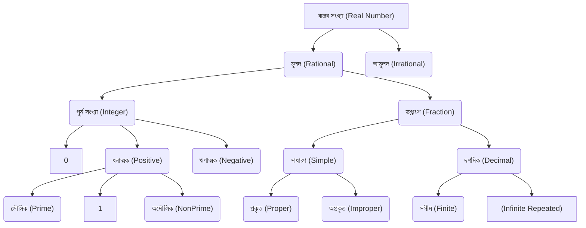

```mermaid
graph TD;
    A["বাস্তব সংখ্যা (Real Number)"] --> B("মূলদ (Rational)")
    A --> C("আমূলদ (Irrational) ")
    B --> D("পূর্ন সংখ্যা (Integer) ")
    B --> E("ভগ্নাংশ (Fraction) ")
    D --> F("ধনাত্মক (Positive) ")
    D --> 0
    D --> G("ঋণাত্মক (Negative) ")
    E --> H("সাধারণ (Simple) ")
    E --> I("দশমিক (Decimal) ")
    F --> K("মৌলিক (Prime)")
    F --> 1
    F --> L("অমৌলিক (NonPrime)")
    H --> M("প্রকৃত (Proper)")
    H --> N("অপ্রকৃত (Improper)")
    I --> O("সসীম (Finite)")
    I --> J["(Infinite Repeated)"]

```

